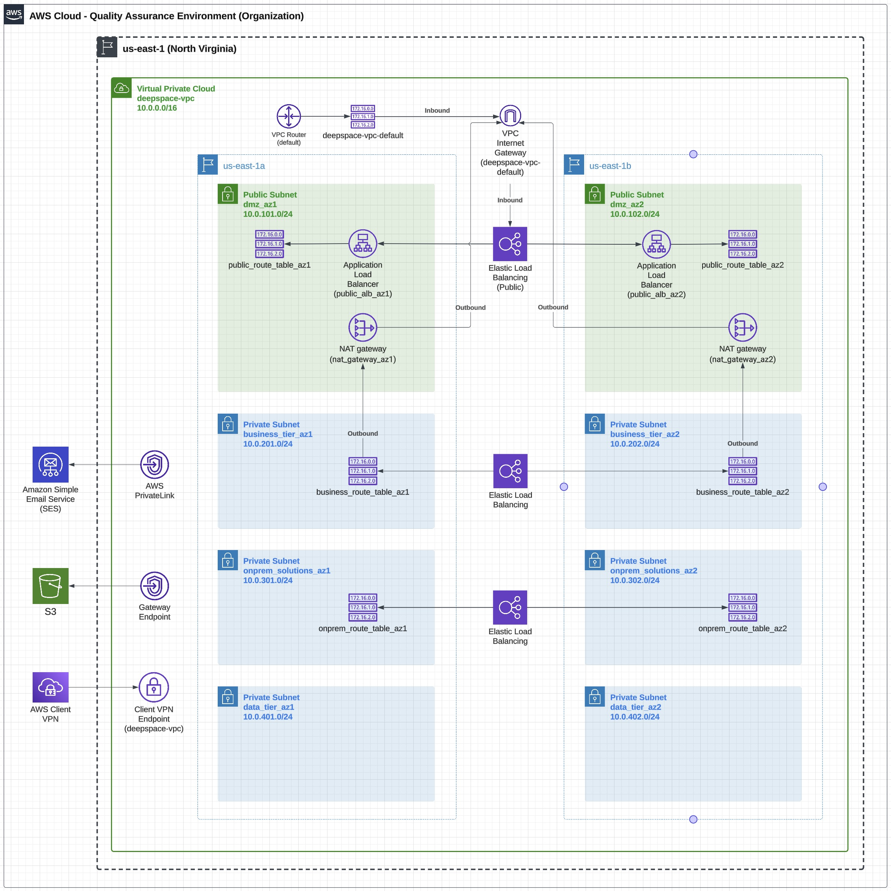

# Summary 
(Work in progress - documentation pending)

## Goals
Managing COPA v1 and COPA Cloud environments (DEV, PROD, QA, etc) using reusable and version controlled components, this project demonstrates a generalized implementation of AWS services.

    1. Networking (In progress)
    2. Roles and Permissions (In progress)
    3. Serverless VMs using Amazon Fargate for compute (Pending)
    4. Serverless VMs using Amazon RDS for database storage (Pending)
    5. Amazon S3 for cloud storage and archival (Pending)
    6. Amazon SES for email services 

## Project Structure
```
.
├── README.md
├── environments
│   ├── dev
│   │   ├── backend.tf
│   │   ├── example.terraform.tfvars
│   │   ├── main.tf
│   │   ├── output.tf
│   │   ├── terraform.tfvars
│   │   └── variables.tf
│   └── prod
│       ├── backend.tf
│       ├── main.tf
│       ├── output.tf
│       ├── terraform.tfvars
│       └── variables.tf
├── global
│   ├── iam
│   └── s3
├── modules
│   ├── ec2
│   ├── elb
│   ├── igw
│   │   ├── main.tf
│   │   ├── output.tf
│   │   └── variable.tf
│   ├── nacl
│   │   ├── main.tf
│   │   ├── output.tf
│   │   └── variable.tf
│   ├── nat
│   │   ├── main.tf
│   │   ├── output.tf
│   │   └── variables.tf
│   ├── rds
│   ├── route_table
│   │   ├── main.tf
│   │   ├── output.tf
│   │   └── variable.tf
│   ├── subnet
│   │   ├── main.tf
│   │   ├── output.tf
│   │   └── variables.tf
│   └── vpc
│       ├── main.tf
│       ├── output.tf
│       └── variables.tf
├── providers
│   └── aws.tf
└── terraform.tfstate.d
    └── dev

```

## Target Network Design

